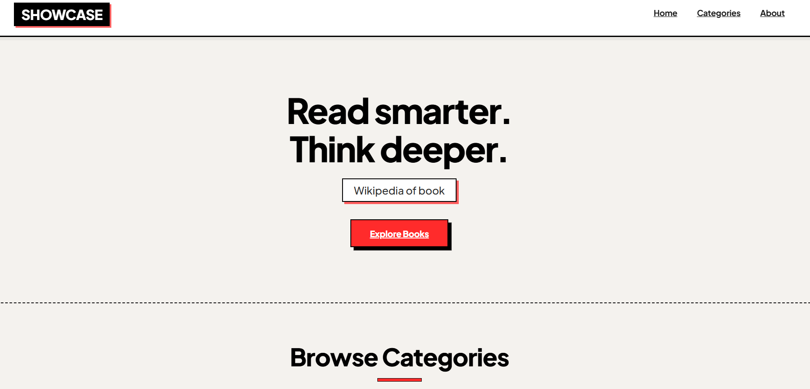
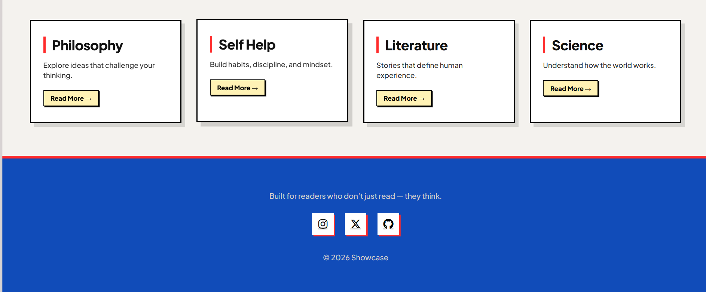

Showcase is a wikipedia of books that allows you to read all the summaries of different 
books in different fields.

Try out yourself : https://showcase-six-coral.vercel.app/

https://devwisz.github.io/showcase/

Some of the UI previews : 

Features : 
1. Reviews of books of different genres.
2. Summaries of books of different genres.
3. Mentioned all the Ratings and Authors of different top books.
4. Buying links of different books mentioned over there.
5. Recommendations of top notch books.
6. Smooth and Easy UI 
7.Category-based navigation (Philosophy, Self Help, Literature, Science)

Inspiration :
I always love to read book but never found any proper and credible source to read the books so i made this platform.

Developed and Design by : 
devWisZ

